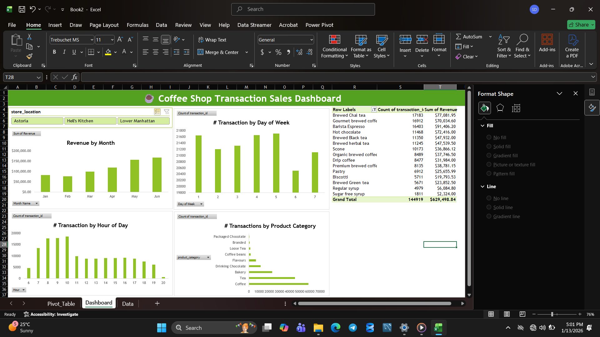

Interactive Excel dashboard analyzing coffee shop sales data
# ☕ Coffee Shop Sales Dashboard (Excel)

## 📌 Project Overview
This project is an **interactive Excel dashboard** created to analyze coffee shop sales transactions.  
The dashboard provides insights into **revenue trends, customer purchasing behavior, and product performance** to support data-driven business decisions.

## 🎯 Objective
To analyze coffee shop sales data and answer key business questions such as:
- Monthly revenue trends
- Peak sales hours
- Popular product categories
- High-performing store locations

## 📊 Key Insights
- Revenue shows steady growth from January to June
- Peak transactions occur during morning hours (8–10 AM)
- Coffee and Tea contribute the highest revenue
- Weekdays generate more transactions compared to weekends

## 🛠 Tools & Techniques Used
- Microsoft Excel
- Pivot Tables
- Pivot Charts
- Slicers & Filters
- Data Cleaning & Formatting
- Dashboard Design

## 📈 Dashboard Features
- Revenue by Month
- Transactions by Day of Week
- Transactions by Hour of Day
- Product Category Performance
- Store Location Filter (Astoria, Hell’s Kitchen, Lower Manhattan)

## 📊 Dashboard Preview

👩‍💻 Skills: Excel, SQL, Python, Power BI  

